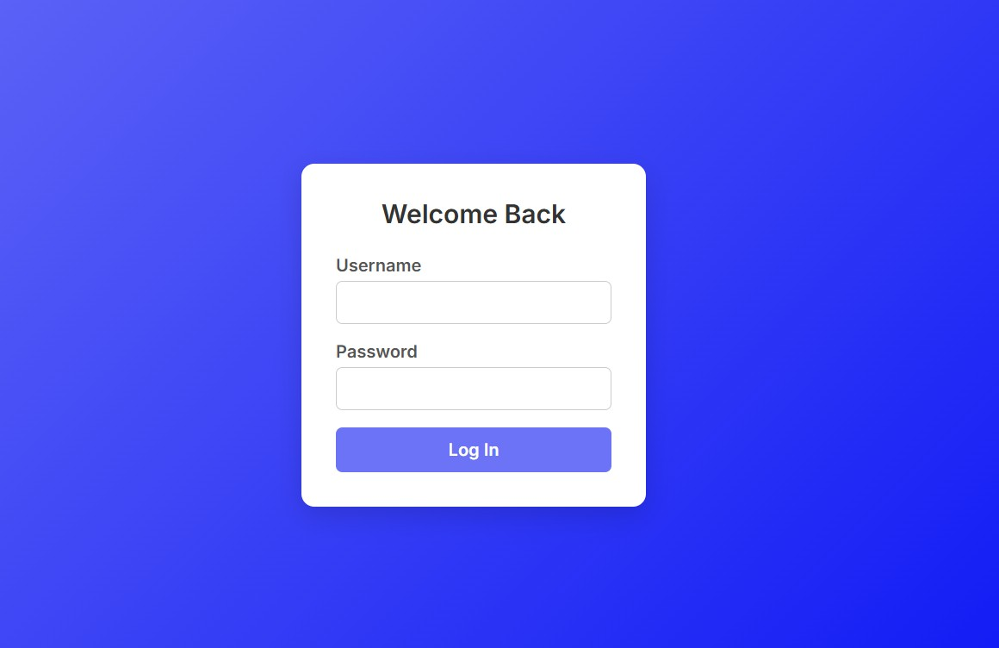
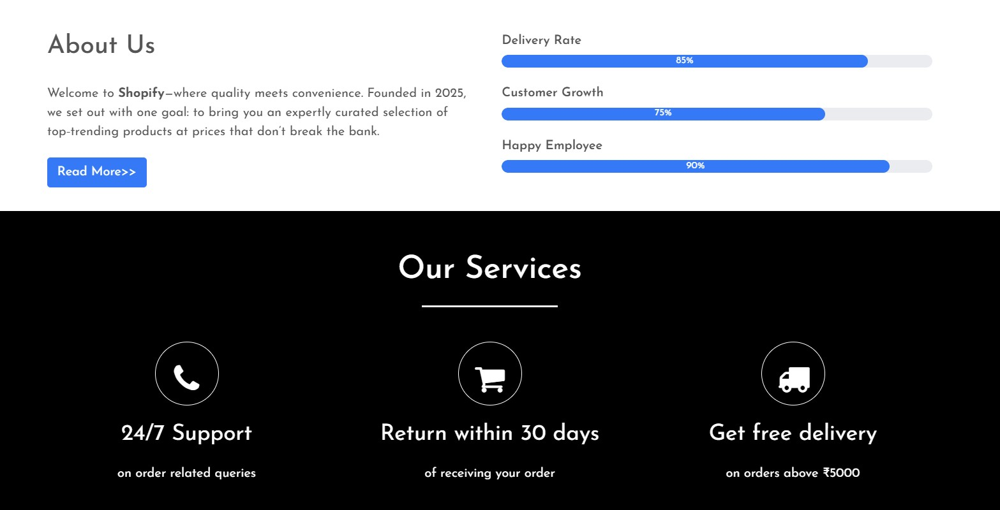

The name of this website is Shopify.
It is a website that provides all the user model based features in an ecommerce app from login, to prodcut checkout.
The user first sees the login page.The username is ("hrishavkhanal") and the passowrd is ("12345").

After successful login the person is shown the main page,where the customer can view the products and add them to cart.Various sections like New Arrivals,On Sale are there.

The user also has the facility of contacting the associated facilities.Links to various social media pages are also provided

The cart has various features as seen in the screenshot below.There needs to be atleast one product to proceed to checkout

The Billing Address is taken and the Home Address is taken separtely.One can select then to be the same.

The final Checkout page,shows all our information as well as information regrading the order.Then we can go on to pay via PayPal.This feature links to the Payment gateway but no payment can be done.

